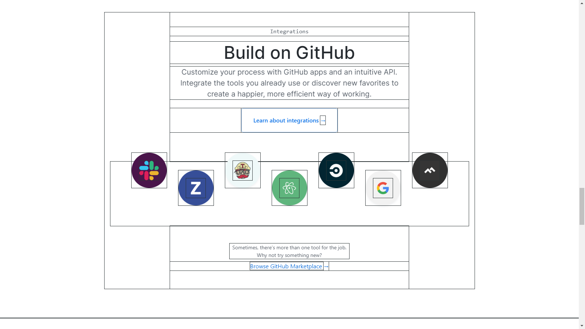

# What Is This?

This is a small file that can help you to debug your css in a wireframe style.

### Clone The Repo

```bash
    git clone https://github.com/Sanusihassan/css-debugger.git
```

### Install Using npm

```bash
    npm install css-debugger
```

### Include File Using cdn.jsdelivr

```html
    <link rel="stylesheet" href="https://cdn.jsdelivr.net/gh/Sanusihassan/css-debugger/dist/css-debugger.min.css">
```

## Usage

```html
    <body data-debug="*">
        ...
    </body>
```
This will add `outline: 1px solid #2d3436` to every single element inside the body element.



This will add the outline only to the direct childrens of the section.

```html
    <section data-debug="each">
        <div>item 1</div>
        <div>item 2</div>
        <div>item 3</div>
    </section>
```

This will add the outline to the section itself and not it's children.

```html
    <section data-debug="self">
        ...
    </section>
```

## How To Turn Off The Debugging On A Specific Area?

This will turn off the debugging on the section but not on it's children.

```html
    <body data-debug="*">
        <section data-debug-self="off">
            <div>item 1</div>
            <div>item 2</div>
            ...
        </section>
        ...
    </body>
```

This will turn off the debugging on each direct children of the section but not the sub childrens.

```html
    <body data-debug="*">
        <section data-debug-each="off">
            <div>item 1</div>
            <div>item 2</div>
            ...
        </section>
        ...
    </body>
```

This will turn off the debugging on every single child inside the section including sub childrens.

```html
    <body data-debug="*">
        <section data-debug-all="off">
            <div>item 1</div>
            <div>item 2</div>
            ...
        </section>
        ...
    </body>
```

## Customizing the outline

If you want to change the outline color for example, use the `--debug` vaiable.

It is defined as follows:

```css
    :root {
        /* change color or size by modifing this variable */
        --deubg: 1px solid #2d3436;
    }
```

## Conclusion

Don't Forget to Disable this on Production.

> Ask [me](https://twitter.com/__sanusi) any questions at any time.